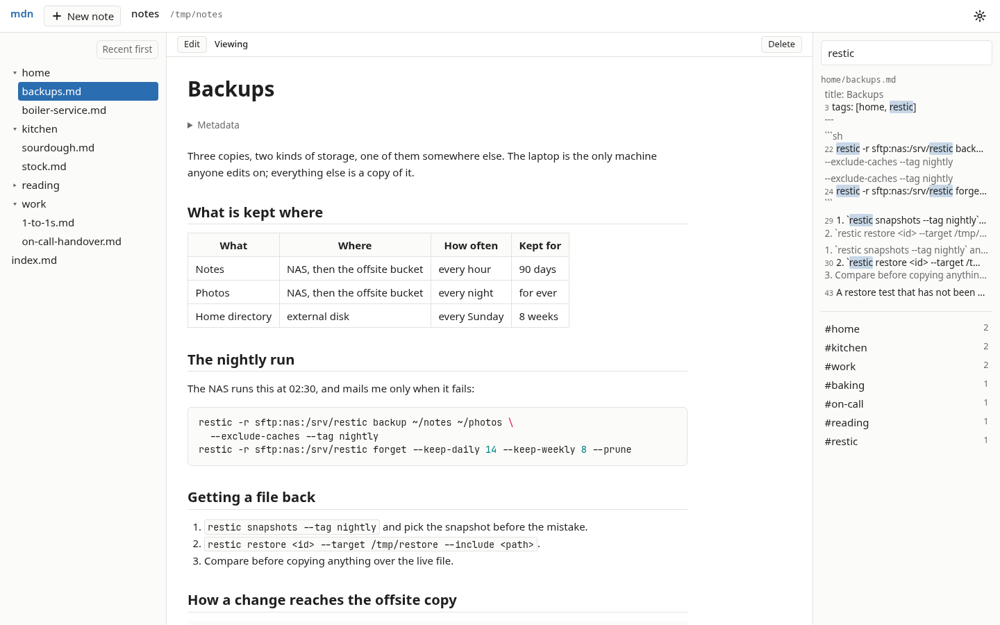
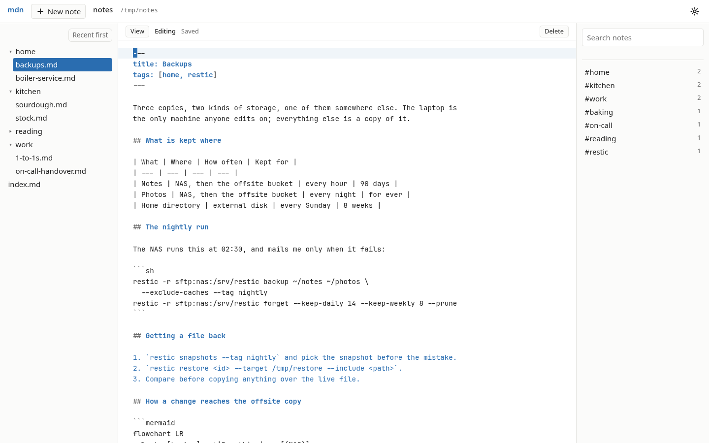
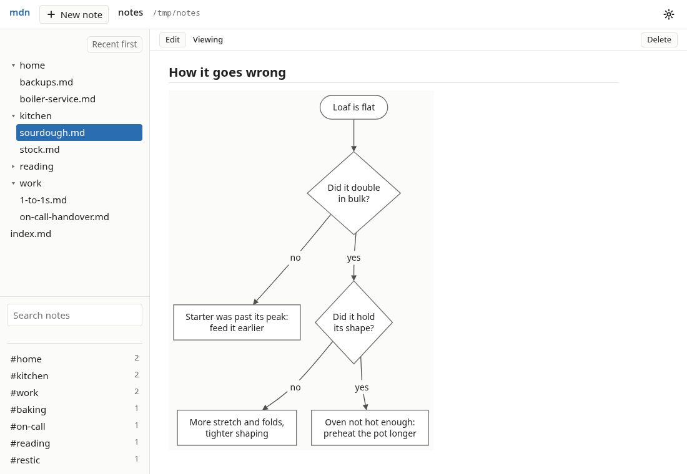
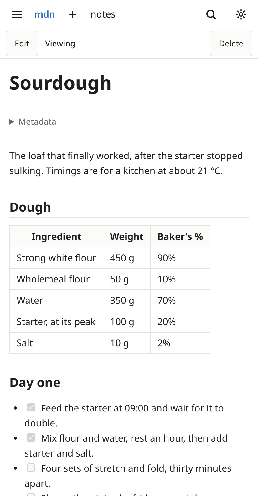
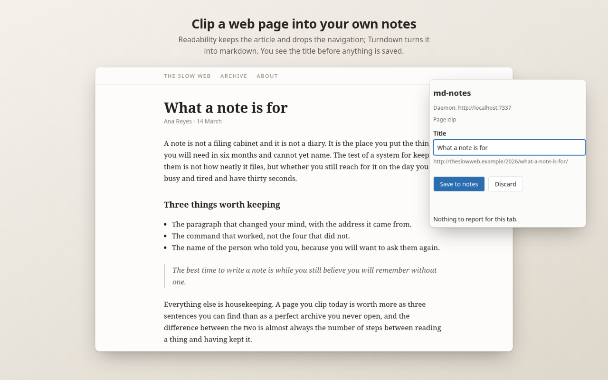

# md-notes

Your notes as plain markdown files in ordinary folders, and a fast, quiet app in
the browser to read, write and find them. One small program, `mdn`, runs on your
own machine and serves the app; the files stay exactly where they are, in a form
any editor can open. It doubles as a markdown viewer for any folder on disk, such
as a code project's docs.

<picture>
  <source media="(prefers-color-scheme: dark)" srcset="docs/images/app/wide-dark.png">
  
</picture>

## Why you might want it

- **The files stay yours, and stay plain.** A note is a `.md` file in a folder
  you chose. There is no database, no export step and no format to escape from:
  `vim`, `grep`, `git` and any other markdown editor work on the same files, and
  the app shows their edits as they land.
- **No account, no cloud, no lock-in.** Nothing leaves your machine unless you
  send it. There is nothing to sign up to and nothing to pay for.
- **It does a few things well and nothing else.** Reading, writing and finding
  notes, without a plugin system, a sidebar of features or a sync service of its
  own to trust.

## What it does

- **Renders notes properly**: headings, tables, task lists, footnotes and
  highlighted code, in a light or dark theme that follows your system. The
  navigator lists only markdown, and leaves out whatever your `.gitignore` does.
- **Flips to a capable editor with one key.** `Ctrl+E` turns the rendered note
  into a CodeMirror editor with vim keybindings, and back.
- **Saves as you type, and keeps up with other tools.** Every edit is saved
  automatically, and a change made on disk by anything else shows up without a
  refresh. A note changed elsewhere under an unsaved draft asks before anything
  is lost.
- **Finds things at once.** Search by keyword across a folder, powered by
  ripgrep, with the matching line and its context; and tags, from frontmatter
  or `#hashtags`, that filter the navigator.
- **Clips the web.** A browser extension saves a readable page or a selection
  into your notes as markdown, and opens local `.md` files in the app instead of
  as plain text.
- **Opens any folder.** `mdn open ~/projects/some-repo` browses a project's
  markdown the same way, without making it part of your notes.
- **Works on a phone and an e-ink tablet.** The layout gives the note the whole
  screen on a small one, installs as an app on Android, and has settings for a
  panel with no backlight.

<picture>
  <source media="(prefers-color-scheme: dark)" srcset="docs/images/app/editor-dark.png">
  
</picture>

## Diagrams

A mermaid flowchart in a note is drawn as a diagram, in the theme you are
reading in, and redrawn when the note changes.

<picture>
  <source media="(prefers-color-scheme: dark)" srcset="docs/images/app/flowchart-dark.png">
  
</picture>

It is the daemon that draws it, not the browser. The app can read and write every
note you have, so no diagram source ever runs in it: the daemon parses the
flowchart, lays it out and sends back an image, and the page shows that image
and nothing else. Mermaid's own library was looked at and turned down for exactly
this reason. The daemon draws the flowchart subset of mermaid — the usual shapes,
links, labels and subgraphs — and anything outside it, including the other
diagram types, stays a code block.
[Flowcharts](docs/introduction.md#flowcharts) lists what is drawn and what is
not.

## On a phone, and everywhere else

<picture>
  <source media="(prefers-color-scheme: dark)" srcset="docs/images/app/phone-dark.png">
  
</picture>

The daemon runs on one machine. Your other devices reach the notes one of two
ways.

**Over your tailnet.** The daemon listens only on your own machine, but
`tailscale serve` can put it on your private [Tailscale](https://tailscale.com/)
network behind a login, and then the whole app works from your phone or tablet,
live update and editing included. On Android it installs as an app of its own.

**With Syncthing.** Because the notes are just files,
[Syncthing](https://syncthing.net/) can mirror the folder to your other machines
and your phone, where any markdown editor opens them, offline as well.
md-notes never syncs anything itself; it sees Syncthing's writes as it sees any
other edit.

An e-ink tablet can take either route.
[Sync and offline editing](docs/sync.md) and [On an e-ink tablet](docs/e-ink.md)
have the details.

 

## The browser extension

A Chromium extension for Brave or Chrome clips the readable part of a page, or
just a selection, into a `clips/` folder in your notes, with the address it came
from, and opens local markdown files in the app. [The browser
extension](docs/extension.md) covers it, and [Privacy](docs/privacy.md) says what
it sends where, and what it keeps.

## How it fits together

- **The daemon**, `mdn`: one static Go binary for Linux. It serves the app on
  `localhost`, watches your folders, renders markdown and draws diagrams, and
  uses [ripgrep](https://github.com/BurntSushi/ripgrep) for the tree and for
  search.
- **The app**: a TypeScript web UI built into the binary. Three panes on a wide
  screen, two on a narrower one, and a note with a drawer on a phone.
- **The extension**: the browser half, for clipping and for local files.
- **Syncthing, or your tailnet**, for your other devices. Neither is part of
  md-notes, and neither is required.

## Install

- **Arch Linux**: [`md-notes-bin`](https://aur.archlinux.org/packages/md-notes-bin)
  from the AUR, `paru -S md-notes-bin`.
- **Debian and Ubuntu**: the `.deb` for amd64 or arm64 from the
  [latest release](https://github.com/davison/md-notes/releases/latest).
- **The browser extension**: `mdn-extension-<version>.zip` from the same release,
  loaded unpacked. Read [Privacy](docs/privacy.md) first.

[Installing md-notes](docs/install.md) has the commands, checksums and the bare
binary, and [Running md-notes](docs/running.md) takes it from there: the
configuration file, the systemd unit, the token and several folders at once.

## Documentation

- [Installing md-notes](docs/install.md) and [Running md-notes](docs/running.md):
  getting it going.
- [Introduction](docs/introduction.md): everything the daemon and the app do,
  in detail.
- [The browser extension](docs/extension.md) and [Privacy](docs/privacy.md).
- [Sync and offline editing](docs/sync.md) and
  [On an e-ink tablet](docs/e-ink.md).
- [CONTRIBUTING.md](CONTRIBUTING.md): building from source, the tests, and how a
  change gets merged. [Cutting a release](docs/releasing.md) for maintainers.

## Status

[v0.1.0](https://github.com/davison/md-notes/releases/tag/v0.1.0) is the current
release; [ROADMAP.md](ROADMAP.md) tracks what each milestone delivered and its
record, and the [issues](https://github.com/davison/md-notes/issues) what is
next.

## License

[MIT](LICENSE). The flowchart renderer brings in no third-party code: the label
widths it lays text out with are Noto Sans Regular's advance widths, numbers only,
generated from the font by `internal/diagram/genmetrics`, with no glyph data.
