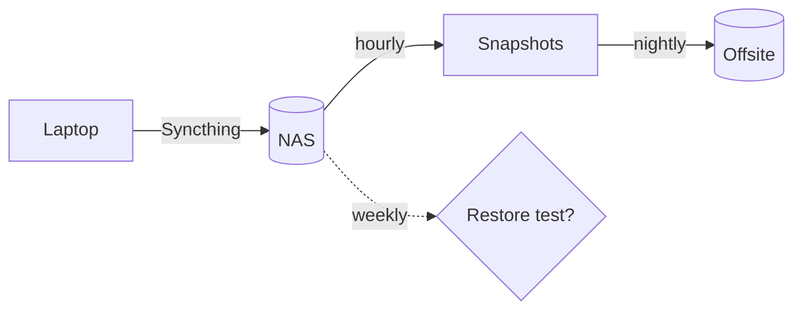

Three copies, two kinds of storage, one of them somewhere else. The laptop is
the only machine anyone edits on; everything else is a copy of it.

## What is kept where

| What | Where | How often | Kept for |
| --- | --- | --- | --- |
| Notes | NAS, then the offsite bucket | every hour | 90 days |
| Photos | NAS, then the offsite bucket | every night | for ever |
| Home directory | external disk | every Sunday | 8 weeks |

Weekend runs also restore one file at random and compare it with the
original, because a backup nobody has restored from is only a hope.

## The nightly run

The NAS runs this at 02:30, and mails me only when it fails:

```sh
restic -r sftp:nas:/srv/restic backup ~/notes ~/photos \
  --exclude-caches --tag nightly
restic -r sftp:nas:/srv/restic forget --keep-daily 14 --keep-weekly 8 --prune
```

## Getting a file back

1. `restic snapshots --tag nightly` and pick the snapshot before the mistake.
2. `restic restore <id> --target /tmp/restore --include <path>`.
3. Compare before copying anything over the live file.

## How a change reaches the offsite copy


