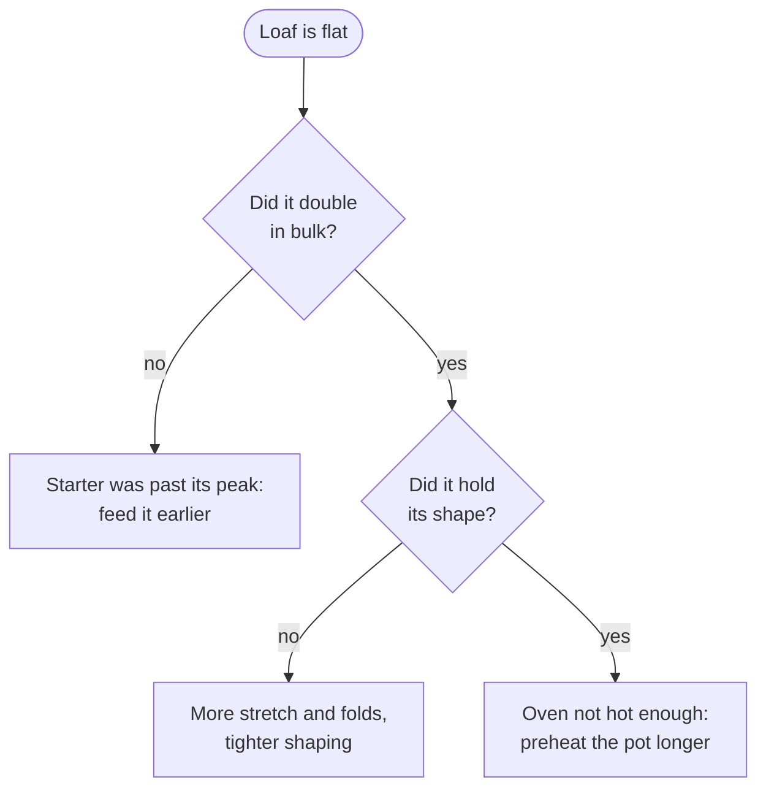

The loaf that finally worked, after the starter stopped sulking. Timings are
for a kitchen at about 21 °C.

## Dough

| Ingredient | Weight | Baker's % |
| --- | --- | --- |
| Strong white flour | 450 g | 90% |
| Wholemeal flour | 50 g | 10% |
| Water | 350 g | 70% |
| Starter, at its peak | 100 g | 20% |
| Salt | 10 g | 2% |

## Day one

- [x] Feed the starter at 09:00 and wait for it to double.
- [x] Mix flour and water, rest an hour, then add starter and salt.
- [ ] Four sets of stretch and fold, thirty minutes apart.
- [ ] Shape, then into the fridge overnight.

## Day two

Bake from cold in a lidded pot: 20 minutes at 250 °C with the lid on, then
25 minutes at 230 °C without it. Leave it an hour before cutting, however good
it smells.

## How it goes wrong

